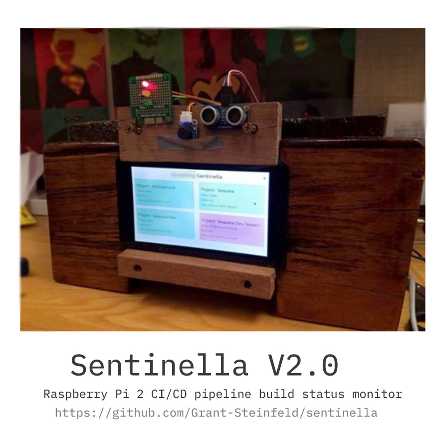

# Sentinella Project

This project is to monitor git repositories status, by and a Element14 7" Touchscreen Display and a Raspberry Pi 2 

*** Sentinella v2 at work Menlo Park ( 2017 )***

## Dependencies

### Python 2

* flask
* flask-cors

### Apache2 or other web server

### Chromium-browser

## To run sentinella

Run sentinella.sh under the root folder.
